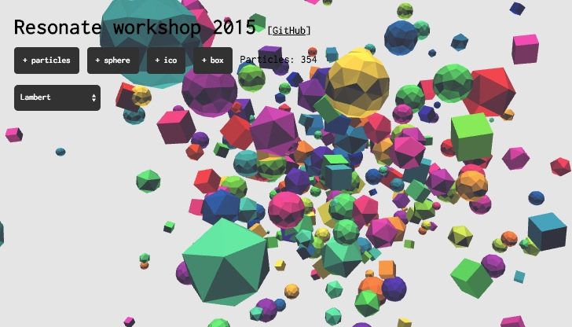

# resonate-workshop-2015



[](https://gitter.im/learn-postspectacular/resonate-workshop-2015?utm_source=badge&utm_medium=badge&utm_campaign=pr-badge&utm_content=badge) | [interactive version @ demo.thi.ng](http://demo.thi.ng/geom/resonate-2015/index.html)

April 13-15, 2015 Belgrade

## Preparations / requirements

To make the most of our time next week and since online connectivity
at the workshop venue has been traditionally sporadic, please ensure
you have the following requirements met before the workshop begins on
Monday:

- [Java JDK 7 or 8](http://www.oracle.com/technetwork/java/javase/downloads/index.html)
- [Leiningen](http://leiningen.org)
- [Counterclockwise (CCW)](http://doc.ccw-ide.org/documentation.html#install-as-standalone-product)

The last tool (CCW) is an Eclipse based Clojure IDE, which is
x-platform, easy to install and we already used successfully in
[last year's workshop](https://github.com/learn-postspectacular/resonate-workshop-2014).
However, this just a recommendation and you're of course free to use
any other editor.

Please also already clone this repo and execute the following to force
downloading most (if not all) other necessary library dependencies:

```
cd resonate-workshop-2015
lein deps
```

## Running the demo

The WebGL example shown above (and described below) can be run like this:

```
cd resonate-workshop-2015
lein figwheel
```

The above is building the development version and starts a server on
http://localhost:3449/

Whilst the figwheel server is running, any changes done to the source
code are automatically recompiled & applied to the running browser
session.

To build a minified & optimized JS version of this code, stop the
figwheel server (`Ctrl+D`) and run these commands:

```
lein do clean, cljsbuild once min
open resources/public/index.html
```

The demo is partially interactive:

- Press `SPACE` to spawn 10 more random particles (see note below)
- Click any of the buttons to create specific particles
- Use mouse to rotate 3D view

*Note*: The performance of this example is not amazing and the code is
 not very optimized (we were focused on learning new concepts after
 all). Furthermore, WebGL itself is not happy with drawing hundreds of
 tiny VBOs each with potentially different shader instances. In an
 ideal world, the mesh drawing/handling would use large vertex buffers
 for multiple meshes, each with more attributes to specify the unique
 for data of each mesh instance. Instead, we're currently bombarding
 the WebGL driver with a multitude of render states and performance
 goes down v.quickly...

## Daily reports

### Day 1

- Clojure introduction
- Simple project setup via CCW
- Working with the REPL
- Clojure sequence API
- Development of a simple Entity-component system (ECS) as excuse to
  introduce many important Clojure concepts

### Day 2 & 3

We spent these last two days developing a little WebGL demo based
around a refined version of the ECS developed a day earlier and spent
much time talking about the many new concepts around:

- Clojurescript (the language, cross-compilation, tooling (i.e.
  Figwheel, Cljsbuild etc.)
- ReactJS integration (via the awesome reagent & re-frame)
- WebGL basics (vector & matrix algebra, shaders, VBOs)
- Basic channel operations w/ core.async
- Encoding HTML/SVG as Clojure datastructures (hiccup format)

## Libraries

- [thi.ng/geom](http://thi.ng/geom)
- [reagent](http://reagent-project.github.io/)
- [re-frame](https://github.com/Day8/re-frame)
- [figwheel](https://github.com/bhauman/lein-figwheel)
- [ReactJS](http://facebook.github.io/react/)

## Reading list & references

### Clojure & ClojureScript introduction

- [Clojure](http://clojure.org)
- [ClojureScript](https://github.com/clojure/clojurescript) ([quickstart](https://github.com/clojure/clojurescript/wiki/Quick-Start), [wiki](https://github.com/clojure/clojurescript/wiki))
- [Leiningen sample project (full options)](https://github.com/technomancy/leiningen/blob/master/sample.project.clj)

#### Tutorials

- [Tutorial @ CAN](http://www.creativeapplications.net/tutorials/introduction-to-clojure-part-1/)
- [Brave Clojure](http://www.braveclojure.com/)
- [Clojure from the ground up](https://aphyr.com/posts/301-clojure-from-the-ground-up-welcome)

### Entity Component Systems

- [Understanding ECS](http://www.gamedev.net/page/resources/_/technical/game-programming/understanding-component-entity-systems-r3013)
- [T-Machine ECS blog series](http://t-machine.org/index.php/2007/09/03/entity-systems-are-the-future-of-mmog-development-part-1/)
- [Chris Granger's Chromashift](http://www.chris-granger.com/2012/12/11/anatomy-of-a-knockout/)

### Reactive programming

- [core.async](https://github.com/clojure/core.async) ([docs](http://clojure.github.io/core.async/), [walkthrough](https://github.com/clojure/core.async/blob/master/examples/walkthrough.clj))
- [React.js](http://facebook.github.io/react/)
- [Reagent](http://reagent-project.github.io)
- [Re-frame](https://github.com/Day8/re-frame/)

### Data transformations

- [Rich Hickey's Transducers talk](https://www.youtube.com/watch?v=6mTbuzafcII)

### Data, data, data (derived views, compute graphs etc.)

- [Turning the DB inside out](https://www.youtube.com/watch?v=fU9hR3kiOK0)
- [Signal/Collect](http://www.signalcollect.com)

## Get in touch

If you run into any problems, please get in touch via the above
[gitter.im room](https://gitter.im/learn-postspectacular/resonate-workshop-2015),
which we will use as backchannel.
